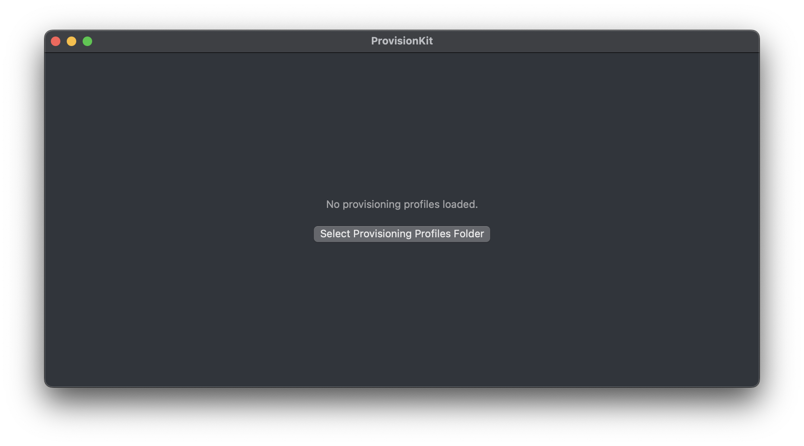

# ProvisionKit

ProvisionKit is a simple macOS utility built with SwiftUI to help developers inspect and browse their local provisioning profiles. It provides a user-friendly interface for viewing metadata such as UUIDs, team identifiers, expiration dates, and the list of provisioned devices.

## ✨ Features

- 📂 Select a folder containing `.mobileprovision` files
- 🧾 Display detailed information for each provisioning profile:
  - Profile name
  - UUID
  - Team Identifier
  - Creation and expiration dates
  - Associated devices (with search support)
- 🌓 Dark Mode support
- 🖱️ Native SwiftUI experience with sidebar navigation

## 📸 Preview

Here’s how the UI looks:

### Select Provisioning Profiles Folder


### Profiles Sidebar & Device Detail


## 🚀 Getting Started

### Requirements

- macOS 13.0+
- Xcode 15+
- Swift 5.9+

### Build & Run

1. Clone the repository:

```bash
git clone https://github.com/azisramdhan/ProvisionKit.git
cd ProvisionKit
```

2. Open the Xcode project:

```bash
open ProvisionKit.xcodeproj
```

3. Run the app using the macOS target (`Cmd + R`)

## 🛠 How It Works

ProvisionKit reads `.mobileprovision` files from the selected folder (default suggestion: `~/Library/MobileDevice/Provisioning Profiles`) and parses them using Apple's `PropertyListSerialization` to extract profile data.

### Extracted Metadata Includes:

- `Name`: The name of the provisioning profile
- `UUID`: Unique identifier of the profile
- `TeamIdentifier`: Your Apple Developer Team ID
- `CreationDate` / `ExpirationDate`
- `ProvisionedDevices`: List of device UDIDs (if applicable)

## 🧩 Folder Access Prompt

The app uses `NSOpenPanel` to prompt the user to select a directory. It defaults to `~/Library/MobileDevice/Provisioning Profiles` for convenience.

## 📂 Folder Structure

```
ProvisionKit/
├── ProvisionKitApp.swift
├── ContentView.swift
├── ProfileInfo.swift
├── ProvisioningProfileLoader.swift
└── DeviceDetailView.swift
```

## 📝 License

This project is open source and available under the [MIT License](LICENSE).

---

## 🙋‍♂️ Author

Azis Ramdhan — [@azisramdhan](https://github.com/azisramdhan)

Feel free to open issues or submit pull requests!
